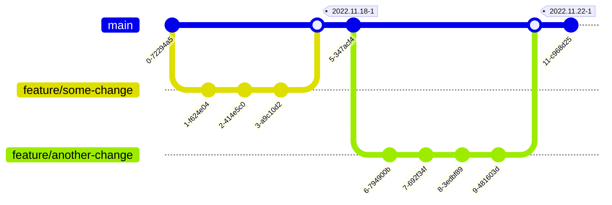

[](https://forthebadge.com)
[](https://forthebadge.com)

# DockerHub Images


This is a monorepository containing the "recipes" (Dockerfile and other required files) of all the publicly available
images (on [DockerHub][mzdh]) maintained and used by MZ Group.


[[_TOC_]]


## Content

Brief summary of what images are available and what does what:

| Image name | Details | Usage |
| ---        | ---     | ---   |
| [`dind-awscli-python`](/dind-awscli-python) | ![][dap-ver]<br>![][dap-pulls]<br>![][dap-size] | Docker image used on Gitlab-CI pipelines to build dockerized Python applications |
| [`dind-awscli-nodejs`](/dind-awscli-nodejs) | ![][dan-ver]<br>![][dan-pulls]<br>![][dan-size] | Docker image used on Gitlab-CI pipelines to build dockerized NodeJS applications |
| [`atlantis-server-prebuilt`](/atlantis-server-prebuilt) | ![][asp-ver]<br>![][asp-pulls]<br>![][asp-size] | Golang compiler image containing pre-built binaries used by the Atlantis server |
| [`gitpod-workspace`](/gitpod-workspace) | ![][gpw-ver]<br>![][gpw-pulls]<br>![][gpw-size] | Base image for Gitpod workspaces with custom applications and other useful configurations |


[mzdh]: https://hub.docker.com/u/mzgroup

[dap-ver]: https://img.shields.io/docker/v/mzgroup/dind-awscli-python?logo=docker&sort=date&style=social
[dap-pulls]: https://img.shields.io/docker/pulls/mzgroup/dind-awscli-python?label=pulls&logo=docker&style=social
[dap-size]: https://img.shields.io/docker/image-size/mzgroup/dind-awscli-python?label=size&logo=docker&style=social

[dan-ver]: https://img.shields.io/docker/v/mzgroup/dind-awscli-nodejs?logo=docker&sort=date&style=social
[dan-pulls]: https://img.shields.io/docker/pulls/mzgroup/dind-awscli-nodejs?label=pulls&logo=docker&style=social
[dan-size]: https://img.shields.io/docker/image-size/mzgroup/dind-awscli-nodejs?label=size&logo=docker&style=social

[asp-ver]: https://img.shields.io/docker/v/mzgroup/atlantis-server-prebuilt?logo=docker&sort=date&style=social
[asp-pulls]: https://img.shields.io/docker/pulls/mzgroup/atlantis-server-prebuilt?label=pulls&logo=docker&style=social
[asp-size]: https://img.shields.io/docker/image-size/mzgroup/atlantis-server-prebuilt?label=size&logo=docker&style=social

[gpw-ver]: https://img.shields.io/docker/v/mzgroup/gitpod-workspace?logo=docker&sort=date&style=social
[gpw-pulls]: https://img.shields.io/docker/pulls/mzgroup/gitpod-workspace?label=pulls&logo=docker&style=social
[gpw-size]: https://img.shields.io/docker/image-size/mzgroup/gitpod-workspace?label=size&logo=docker&style=social


## Git development flow

This project follows a combination of [trunk-based development][trunkb] and [CalVer versioning convention][calver].
Changes/improvements are made via feature-branches that must be quickly be merged against the trunk (main).

A delivery is made when a new tag is pushed. Tags must follow the `YYYY.MM.DD-COUNTER` convention, where `YYYY`
represents the current year, `MM` the current month (zero padded), `DD` the current day (zero padded) and `COUNTER` an
incremental value that starts at one.

Examples of valid tags:
 - `2022.01.02-1`
 - `2022.10.15-1`
 - `2022.10.15-2`
 - `2022.10.15-3`
 - `2023.12.25-1`
 - `2023.12.25-9999`



The diagram should be read as follows:

1. A new feature branch is created from `main`;
1. Changes are commited to the feature branch;
1. Feature branch is merged back to `main`;
1. A new release is created using a [CalVer tag][calver].

[calver]: https://calver.org/about.html
[trunkb]: https://trunkbaseddevelopment.com


## How this project works

Each directory located at the root of this project represents an image on DockerHub. The directory name matches the
image name exactly. Versioning is "global", meaning that when a git tag is pushed, all images are built and pushed with
that tag.

Considering a project structure that looks like this:

```
.
├── my-image-a
│   └── Dockerfile
├── my-image-b
│   └── Dockerfile
└── README.md

2 directories, 3 files
```

A new git tag named `2022.12.01-1` would build/push two Docker images tagged `mzgroup/my-image-a:2022.12.01-1` and `mzgroup/my-image-b:2022.12.01-1`.

### Under the hood

The magic that makes this repository alive is located at [`.scripts`](/.scripts).

- [`lint-all.sh`](/.scripts/lint-all.sh) runs [Hadolint][hadolint] against the Dockerfile inside each top-level directory;
- [`build-all.sh`](/.scripts/build-all.sh) runs docker build/push against each top-level directory (image).

The linting and build pipeline is runned for all merge requests opened against `main`. The build and push pipeline is runned for all tag pushes.

[hadolint]: https://github.com/hadolint/hadolint
